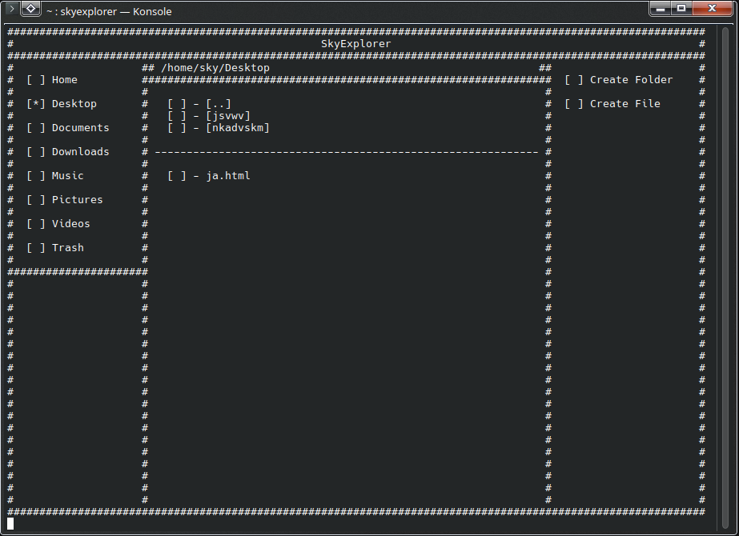
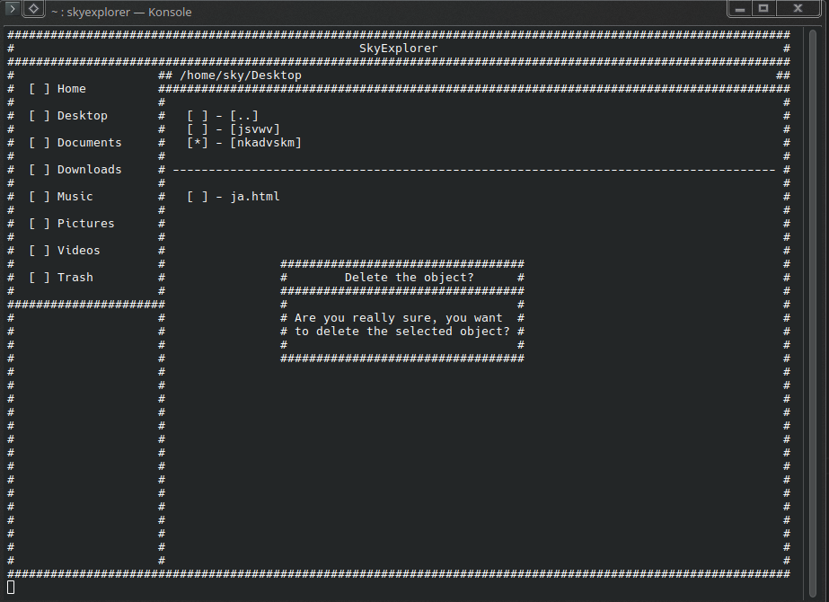

After getting overwhelmed with my SkyDungeon project, I wanted to start with something simpler. A TUI based explorer :D
Its the second alpha 0.2.0 release, and I plan to make it usable for the general terminal enjoyer.
I dont expect people to use it (please dont, it might delete your data) but I dont care, so Im gonna use it lol

# A quick run down:
 
- Its writen in C
- Modularity first, tho the code is a bit messy rn
- No windows support. Maybe later but not now.

## Key features:
 
- Dedicated core functions
- Static locations to open
- Folder movement with the arrow keys and enter
- Can open files with the default program
- Can delete files or folders

#### General Menu Layout:

#### Delete Popup:

## Missing:
 
- Creating files
- Renaming files
- The search bar
- Favorite locations
- Copying to clipboard

## Known bugs:
 
- Currently there are none

It was pretty rough to code. Pointers and references killed me as I also killed my SDDM somehow, BUT I managed to make it work now, and not kill my SDDM.
